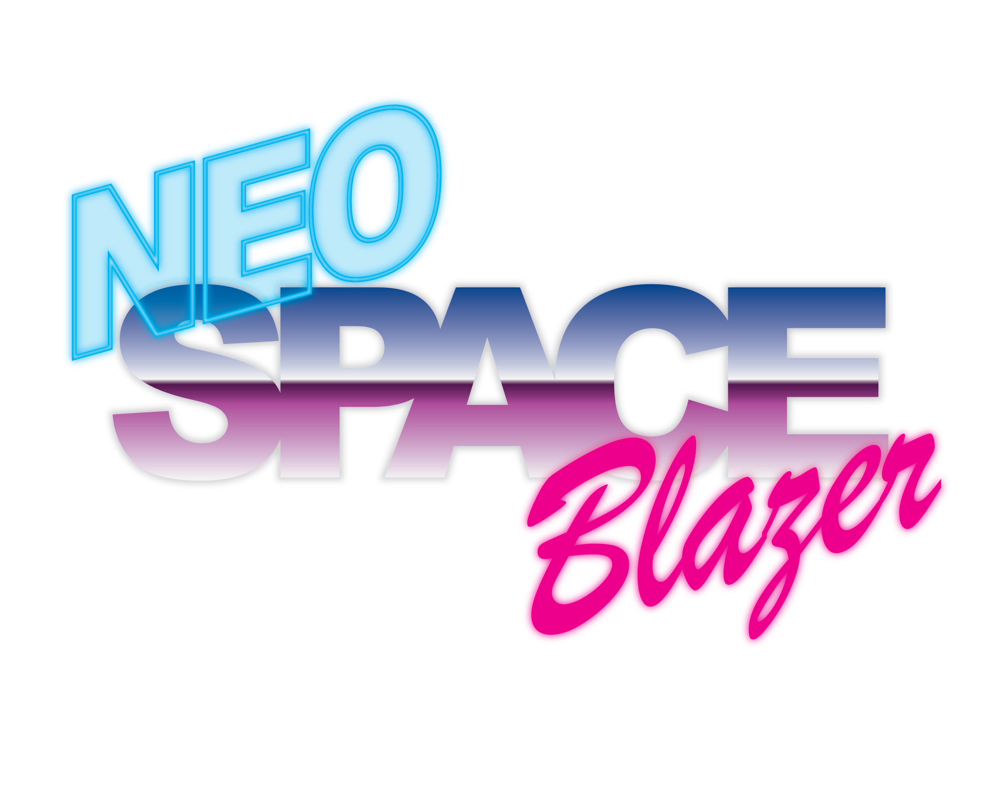
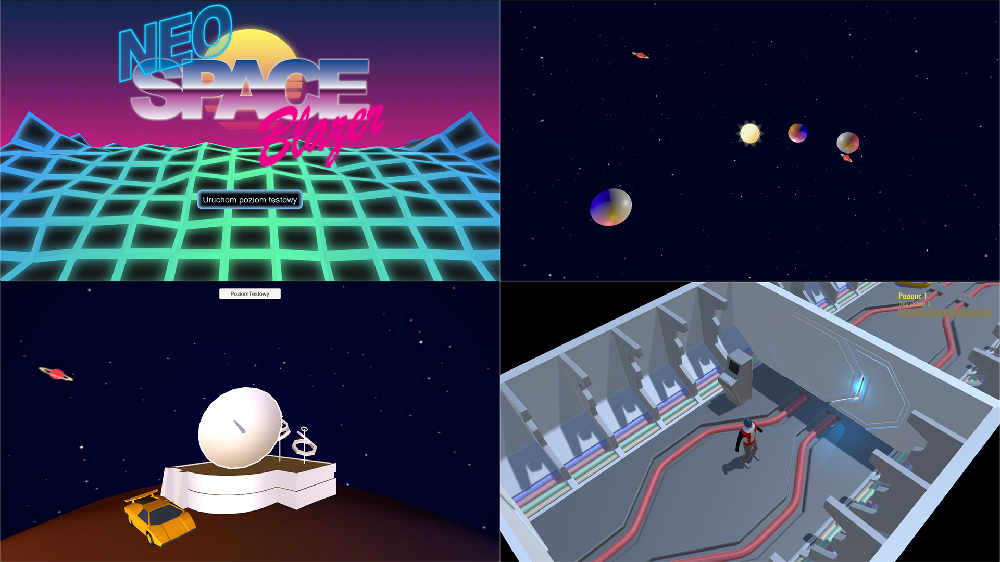
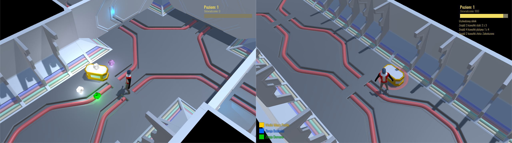
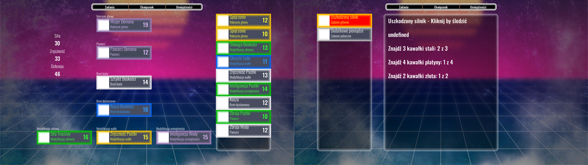

# Neo Space Blazer

Projekt gry RPG, napisany w środowisku 3D.

## Założenia

* Wybór środowiska - planety
* Generowany losowo poziom z określonym celem, aby go zakończyć oraz z pobocznymi zadaniami
* Losowy loot, podzielony na kategorie i poziomy rzadkości

## Co zostało wykonane

* Podstawowe zarządzanie ekwipunkiem
* Prototyp zdobywania zadań za pomocą rozmieszczonych na planszy komputerów
* Określone poziomy rzadkości przedmiotów
* Śledzenie postępu zadania

## Zawartość repozytorium

Projekt wraz ze wszystkimi modelami i grafiką.
